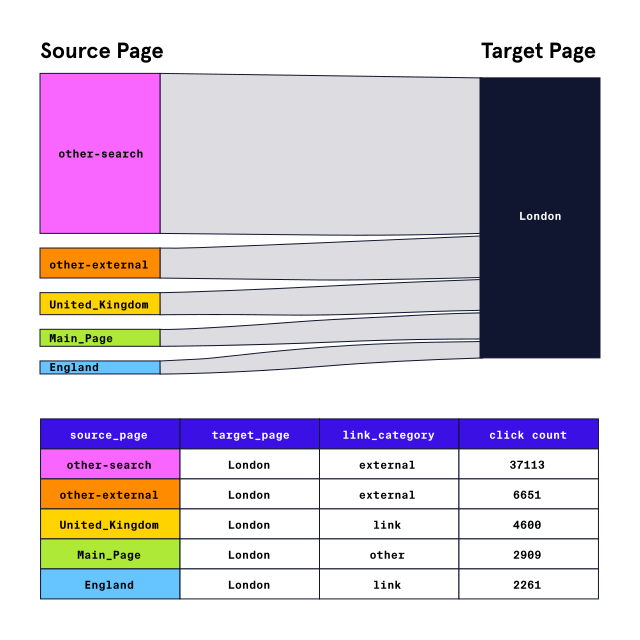

# Analyzing-Wikipedia-Clickstreams-with-PySpark
In this project I clean and analyze a sample of the English language Wikipedias Clickstream data from January 2018 using PySpark SQL.

Wikipedia maintains a dataset called “Clickstream” that records clicks between pairs of linked Wikipedia articles. Because not all readers arrive at a Wikipedia article by clicking a link from another, the dataset also includes categories for clicks that originate outside of Wikipedia (e.g., external-search tracks all clicks coming from major search engines).

This excerpt tells us about 37,000 people accessed the page for London from an external search engine, and about 4,600 people accessed the page by clicking on a link from the Wikipedia article titled “United Kingdom”. Let's delve deeper. 